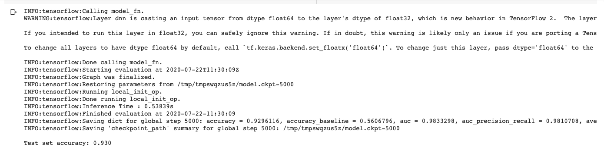
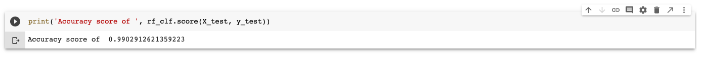

# Bank Note Authentication App

## Dataset - 
Data were extracted from images that were taken from genuine and forged banknote-like specimens. For digitization, an industrial camera usually used for print inspection was used. The final images have 400x 400 pixels. Due to the object lens and distance to the investigated object gray-scale pictures with a resolution of about 660 dpi were gained. Wavelet Transform tool were used to extract features from images.

# Try it yourself

Clone the repository and run cells of notebook.

# Output

1. Tensorflow Estimator 

2. Random Forest Alogorithm

