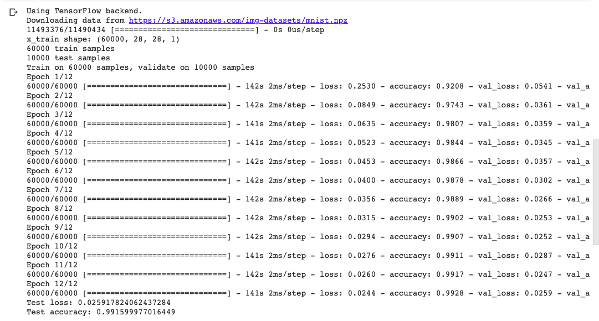
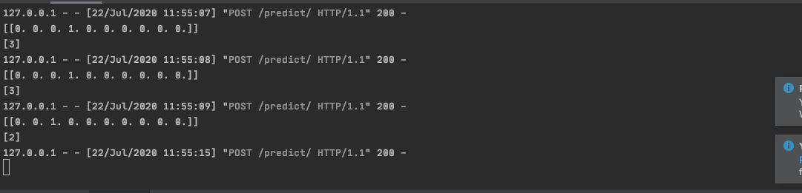
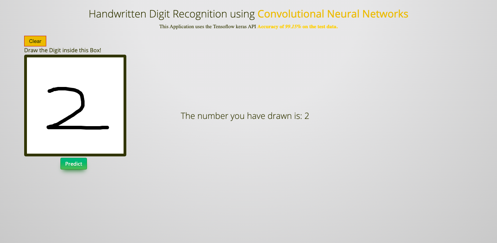
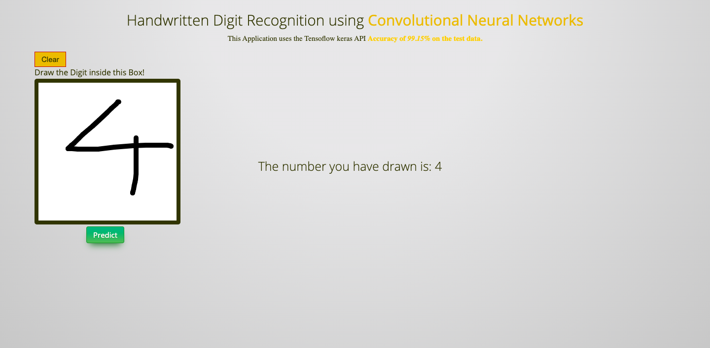
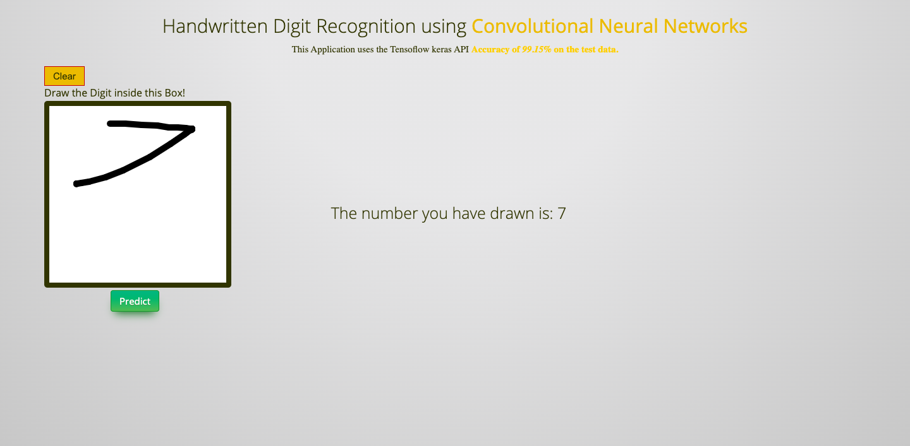
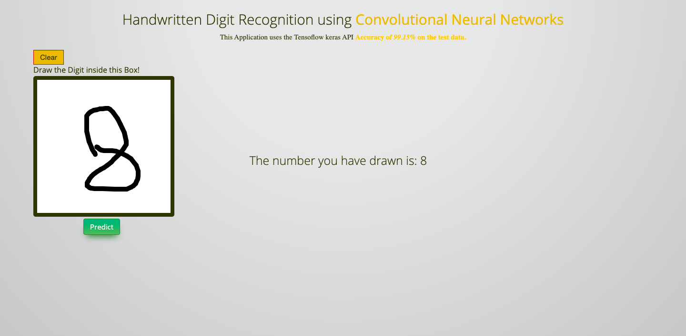

# Digit Classifier - ML App

Build the `Keras Classifier` (with accuracy of 99.15%) to classify hand-written digits.

Deploy the model on flask framework.

## Do it yourself

Run `app.py` in Python enviroment.

## Output

1. Training of the keras model

2. Console output of the program

3. Front end of the application for classifying hand-written 2.

4. Front end of the application for classifying hand-written 4.

5. Front end of the application for classifying hand-written 7.

6. Front end of the application for classifying hand-written 8.

# Thank you!