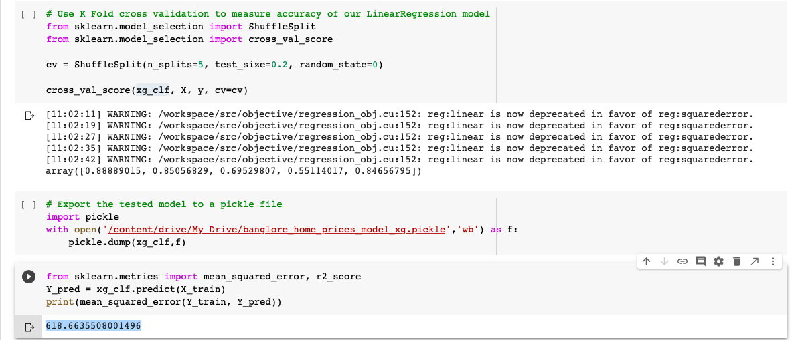
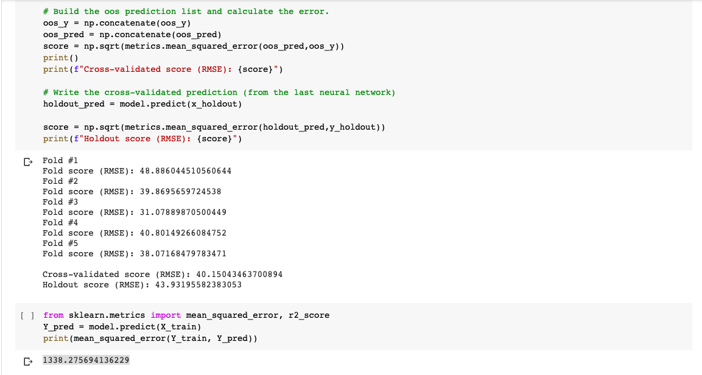
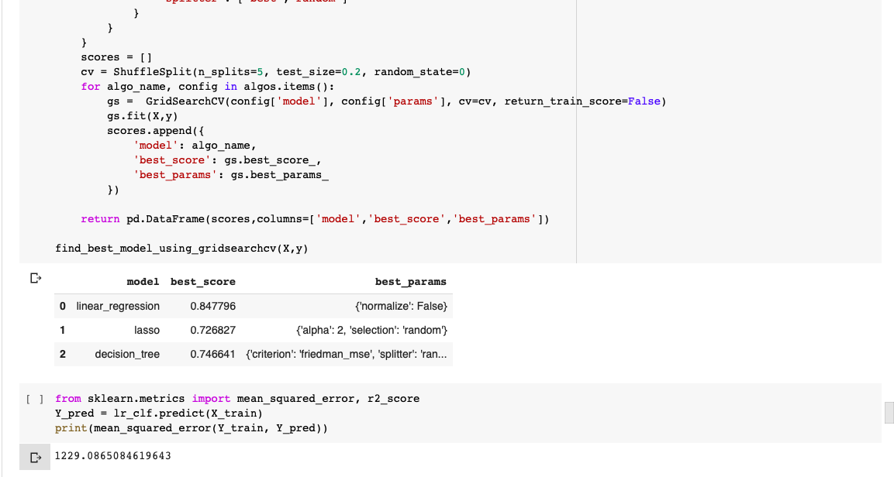
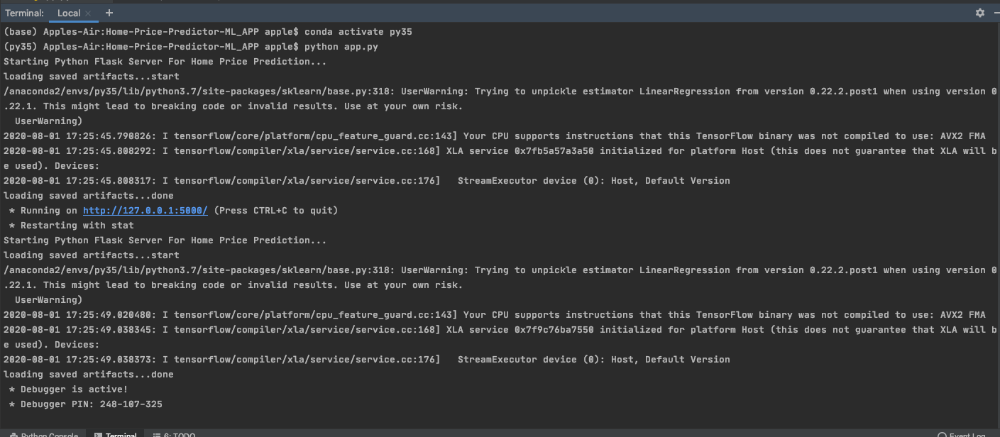
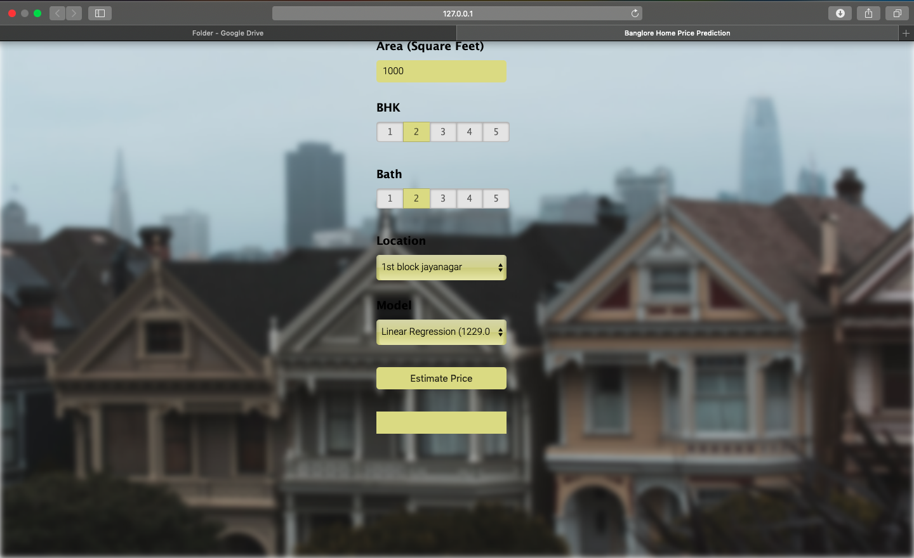
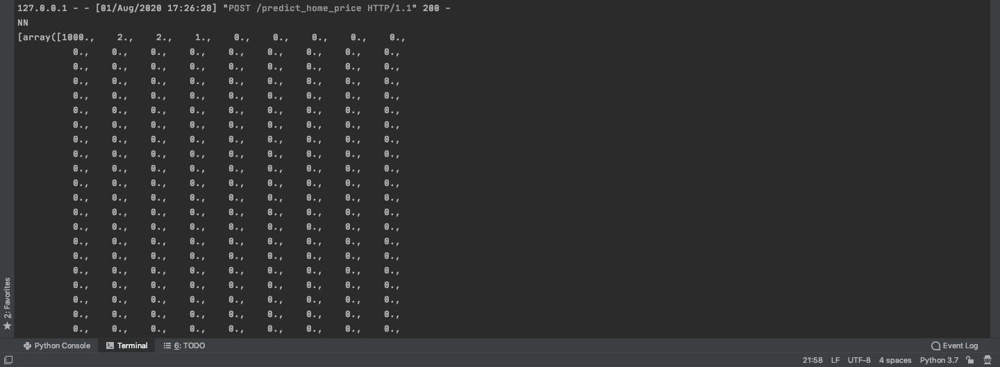
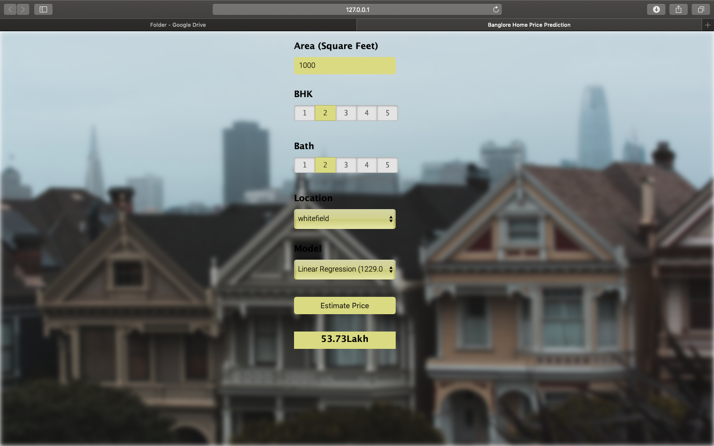
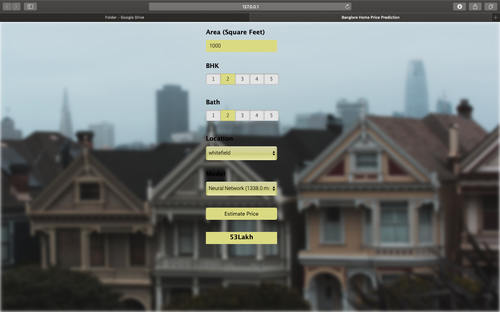
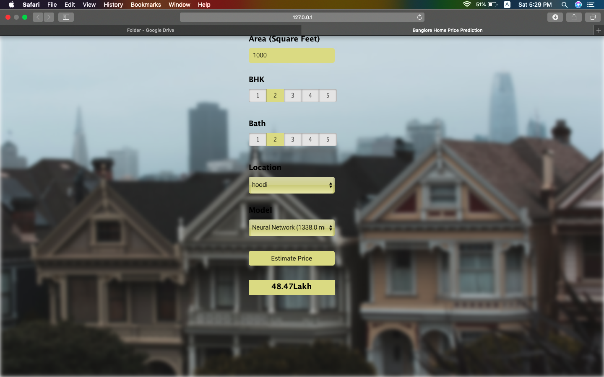

# Home price prediction - ML App

Build the `Regression Model` to predict the Home Prices of Banglore Houses.

Deploy the model on flask framework.

## Do it yourself

Run `app.py` in Python enviroment.

## Output

1. Training of the Regressor model.

2. Check out the MSE score.

3. Check out the best parameters.

4. Console output of deployment.

5. Front end of the application for predicting house price.

6. Console output of Prediction.

7. Prediction (You can select the different regressor model).

8. Prediction (You can select the different regressor model).

9. Prediction (You can select the different regressor model).

10. Prediction (You can select the different regressor model).

**Note :** We still can improve the regressor model. Feel free to help. idea: log transformation, advance regression model (xgboost, lgbm)
# Thank you!