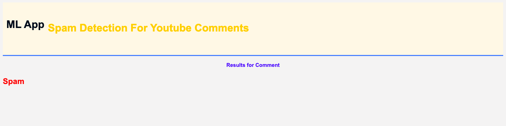

# YouTube comments Spam Detection App

## Dataset - 
Data contains some of the Comments from the video of top YouTuber with labels (Spam or Ham)
# Try it yourself

Run `app.py` in Python enviroment.

# Output

1. Spam Comment output - 
 

2. Ham Comment output -
 

# Thank you!
